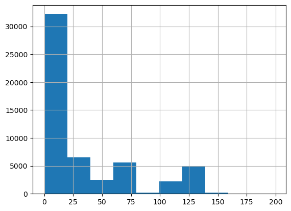
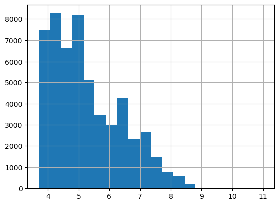
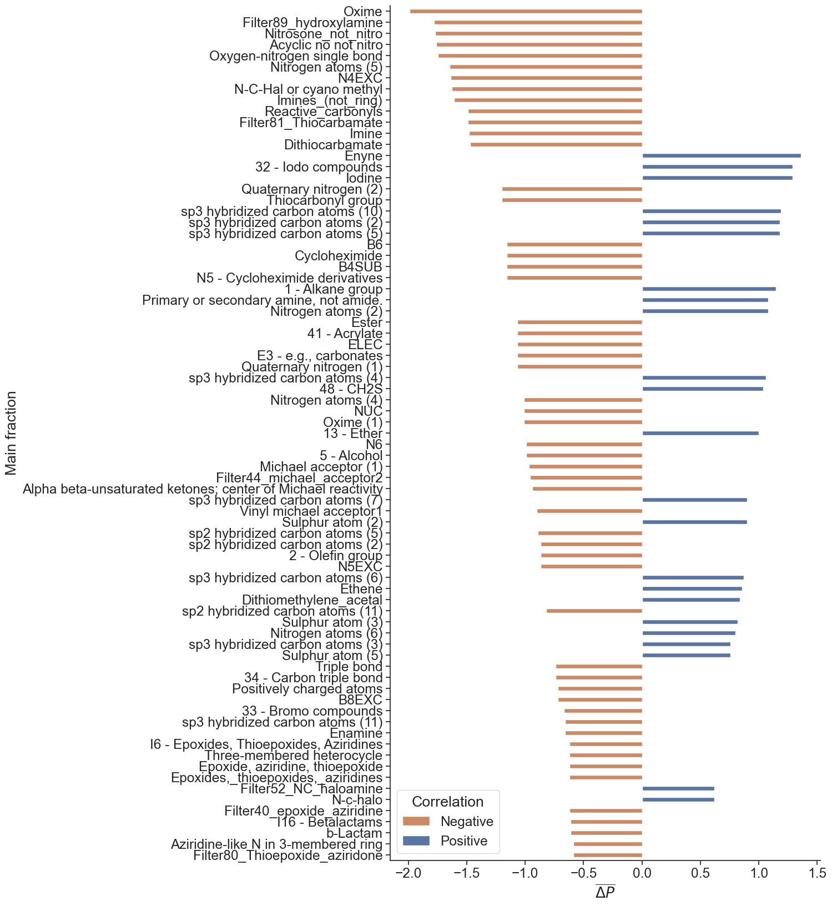

# CHASER Example

This repository contains code and example for CHASER and MMPA implementation (modules mmpa and chaser respectivley)

Example dataset obtained from ChEMBL database and contains activities against E. coli.

Following steps are carried out below: 

1. ChEMBL dataset is curated and processed.
2. MMPA result is obtained
3. MMPA output is curated and proceeed
4. CHESER is implemented to obtain final result.


```python
from CHASER import chaser
from MMPA import mmpa

import pandas as pd
import seaborn as sns

```

# 1. Collect ChEMBL Data


```python
# To colelct this data I selected E. coli as target in chembl (CHEMBL354) and got the resulting activities vs this target:
chembl_e_coli = pd.read_csv('mmpa_data/chembl_ecoli.csv')
```


```python
chembl_e_coli.head() # sample
```


<div>
<style scoped>
    .dataframe tbody tr th:only-of-type {
        vertical-align: middle;
    }

    .dataframe tbody tr th {
        vertical-align: top;
    }

    .dataframe thead th {
        text-align: right;
    }
</style>
<table border="1" class="dataframe">
  <thead>
    <tr style="text-align: right;">
      <th></th>
      <th>Molecule ChEMBL ID</th>
      <th>Molecule Name</th>
      <th>Molecule Max Phase</th>
      <th>Molecular Weight</th>
      <th>#RO5 Violations</th>
      <th>AlogP</th>
      <th>Compound Key</th>
      <th>Smiles</th>
      <th>Standard Type</th>
      <th>Standard Relation</th>
      <th>...</th>
      <th>Target Organism</th>
      <th>Target Type</th>
      <th>Document ChEMBL ID</th>
      <th>Source ID</th>
      <th>Source Description</th>
      <th>Document Journal</th>
      <th>Document Year</th>
      <th>Cell ChEMBL ID</th>
      <th>Properties</th>
      <th>Action Type</th>
    </tr>
  </thead>
  <tbody>
    <tr>
      <th>0</th>
      <td>CHEMBL523108</td>
      <td>NaN</td>
      <td>None</td>
      <td>384.46</td>
      <td>1</td>
      <td>5.1</td>
      <td>5a</td>
      <td>c1ccc(-c2ccc(OCc3nnc4sc(-c5ccccc5)nn34)cc2)cc1</td>
      <td>MIC</td>
      <td>'='</td>
      <td>...</td>
      <td>Escherichia coli</td>
      <td>ORGANISM</td>
      <td>CHEMBL1158168</td>
      <td>1</td>
      <td>Scientific Literature</td>
      <td>Eur J Med Chem</td>
      <td>2008.0</td>
      <td>None</td>
      <td>NaN</td>
      <td>NaN</td>
    </tr>
    <tr>
      <th>1</th>
      <td>CHEMBL203543</td>
      <td>NaN</td>
      <td>None</td>
      <td>271.71</td>
      <td>0</td>
      <td>2.97</td>
      <td>2d</td>
      <td>O=C(Cn1nnc2ccccc21)c1ccc(Cl)cc1</td>
      <td>IZ</td>
      <td>'='</td>
      <td>...</td>
      <td>Escherichia coli</td>
      <td>ORGANISM</td>
      <td>CHEMBL1138110</td>
      <td>1</td>
      <td>Scientific Literature</td>
      <td>Bioorg Med Chem Lett</td>
      <td>2006.0</td>
      <td>None</td>
      <td>NaN</td>
      <td>NaN</td>
    </tr>
    <tr>
      <th>2</th>
      <td>CHEMBL1241537</td>
      <td>NaN</td>
      <td>None</td>
      <td>323.31</td>
      <td>0</td>
      <td>2.09</td>
      <td>3a</td>
      <td>O=C(Cn1ncc2cc([N+](=O)[O-])ccc21)N/N=C/c1ccccc1</td>
      <td>IZ</td>
      <td>'='</td>
      <td>...</td>
      <td>Escherichia coli</td>
      <td>ORGANISM</td>
      <td>CHEMBL1240428</td>
      <td>1</td>
      <td>Scientific Literature</td>
      <td>Eur J Med Chem</td>
      <td>2010.0</td>
      <td>None</td>
      <td>NaN</td>
      <td>NaN</td>
    </tr>
    <tr>
      <th>3</th>
      <td>CHEMBL595390</td>
      <td>NaN</td>
      <td>None</td>
      <td>378.5</td>
      <td>0</td>
      <td>3.17</td>
      <td>51</td>
      <td>CC1/C(=N/N2C(=O)CNC2=S)CC(c2ccccc2)NC1c1ccccc1</td>
      <td>MIC</td>
      <td>'='</td>
      <td>...</td>
      <td>Escherichia coli</td>
      <td>ORGANISM</td>
      <td>CHEMBL1153210</td>
      <td>1</td>
      <td>Scientific Literature</td>
      <td>Bioorg Med Chem Lett</td>
      <td>2010.0</td>
      <td>None</td>
      <td>NaN</td>
      <td>NaN</td>
    </tr>
    <tr>
      <th>4</th>
      <td>CHEMBL11505</td>
      <td>NaN</td>
      <td>None</td>
      <td>199.21</td>
      <td>0</td>
      <td>-1.22</td>
      <td>7d</td>
      <td>Cc1cn(COCCN)c(=O)[nH]c1=O</td>
      <td>IC50</td>
      <td>'='</td>
      <td>...</td>
      <td>Escherichia coli</td>
      <td>ORGANISM</td>
      <td>CHEMBL1121868</td>
      <td>1</td>
      <td>Scientific Literature</td>
      <td>J Med Chem</td>
      <td>1981.0</td>
      <td>None</td>
      <td>NaN</td>
      <td>NaN</td>
    </tr>
  </tbody>
</table>
<p>5 rows × 46 columns</p>
</div>


# 2. Curate and save for MMPA


```python
# there are many choices of types of measurements
chembl_e_coli['Standard Type'].value_counts()
```


    MIC           73760
    IZ            11568
    Activity      10851
    Inhibition     7440
    IC50           2452
                  ...  
    NT                1
    MI50              1
    ED 50             1
    ED                1
    MIC>80            1
    Name: Standard Type, Length: 163, dtype: int64


```python
# to carry out mmpa I will leave only MIC type measurement 

chembl_activity = chembl_e_coli[chembl_e_coli['Standard Type']=='MIC']
```


```python
# for current purposes let's ignore all the different assasys that are combined here and examine the activity values all together

chembl_mic['Standard Units'].value_counts()
```


    ug.mL-1             61792
    nM                   9223
    ug cm**-2             252
    ug                    148
    ug mg-1               135
    10'-2 umol/ml         128
    10'-3micromol/ml       33
    10'-2mmol/ml           32
    10'-2micromol/ml       22
    10'-2umol              21
    uL/ml                  20
    ppm                    18
    10^2umol/ml            12
    10'-3uM/ml             11
    microg/cm3              9
    microg                  8
    p.p.m.                  2
    ug disk-1               2
    10^-3mM                 2
    %                       1
    10'4pg/ml               1
    Name: Standard Units, dtype: int64


```python
# to carry out mmpa I will leave only ug.mL-1 type units 
chembl_activity = chembl_activity[chembl_activity['Standard Units']=='ug.mL-1']
```


```python
chembl_activity['Standard Value'] = chembl_activity['Standard Value'].astype(float)
```


```python
# drop the outliers, cut off mic values at 200:
# chembl_activity = chembl_activity[(np.abs(stats.zscore(chembl_activity['Standard Value'], nan_policy='omit')) < 1)]

chembl_activity = chembl_activity[chembl_activity['Standard Value']<200]
```


```python
# MIC distribution
chembl_activity['Standard Value'].hist(bins=10)
```


    <Axes: >


    

    


```python
chembl_activity['Molecular Weight'] = chembl_activity['Molecular Weight'].astype(float)
chembl_activity['Standard Value'] = chembl_activity['Standard Value'].astype(float)
```

```python
chembl_activity = chembl_activity[chembl_activity['Molecular Weight']!='None']
```


```python
# I will turn all the mic values into pMIC values since mmpa work on principle hight values = better. This will greatly simply things for later

def uM(ug, mass):  # write a function that returns uM as calculated by ug * 1/mass * 1000
    return float(ug) * (1/float(mass)) * 1000

chembl_activity["uM"] = chembl_activity.apply(lambda x :uM(x["Standard Value"], x["Molecular Weight"]), axis=1) # apply the function to the databas

# Convert uM to pMIC

chembl_activity['pMIC'] = [round(-1*np.log10(float(x) / 1000000), 2) for x in chembl_activity['Standard Value'].values] 

```

    C:\Users\domin\AppData\Local\Temp\ipykernel_60504\4185074867.py:6: SettingWithCopyWarning: 
    A value is trying to be set on a copy of a slice from a DataFrame.
    Try using .loc[row_indexer,col_indexer] = value instead
    
    See the caveats in the documentation: https://pandas.pydata.org/pandas-docs/stable/user_guide/indexing.html#returning-a-view-versus-a-copy
      chembl_activity["uM"] = chembl_activity.apply(lambda x :uM(x["Standard Value"], x["Molecular Weight"]), axis=1) # apply the function to the databas
    C:\Users\domin\AppData\Local\Temp\ipykernel_60504\4185074867.py:10: RuntimeWarning: divide by zero encountered in log10
      chembl_activity['pMIC'] = [round(-1*np.log10(float(x) / 1000000), 2) for x in chembl_activity['Standard Value'].values]
    C:\Users\domin\AppData\Local\Temp\ipykernel_60504\4185074867.py:10: SettingWithCopyWarning: 
    A value is trying to be set on a copy of a slice from a DataFrame.
    Try using .loc[row_indexer,col_indexer] = value instead
    
    See the caveats in the documentation: https://pandas.pydata.org/pandas-docs/stable/user_guide/indexing.html#returning-a-view-versus-a-copy
      chembl_activity['pMIC'] = [round(-1*np.log10(float(x) / 1000000), 2) for x in chembl_activity['Standard Value'].values]
    


```python
chembl_activity.replace([np.inf, -np.inf], np.nan, inplace=True)
chembl_activity.dropna(subset=["pMIC"], how="all", inplace=True)
```

    C:\Users\domin\AppData\Local\Temp\ipykernel_60504\3063635716.py:1: SettingWithCopyWarning: 
    A value is trying to be set on a copy of a slice from a DataFrame
    
    See the caveats in the documentation: https://pandas.pydata.org/pandas-docs/stable/user_guide/indexing.html#returning-a-view-versus-a-copy
      chembl_activity.replace([np.inf, -np.inf], np.nan, inplace=True)
    C:\Users\domin\AppData\Local\Temp\ipykernel_60504\3063635716.py:2: SettingWithCopyWarning: 
    A value is trying to be set on a copy of a slice from a DataFrame
    
    See the caveats in the documentation: https://pandas.pydata.org/pandas-docs/stable/user_guide/indexing.html#returning-a-view-versus-a-copy
      chembl_activity.dropna(subset=["pMIC"], how="all", inplace=True)
    


```python
chembl_activity['pMIC'].hist(bins=20)
```


    <Axes: >


    

    


```python
# check for nans and save the dataset for mmpa:

chembl_activity.dropna(subset=['Smiles'], inplace=True)

chembl_activity[['Smiles', 'pMIC']].to_csv('chembl_e_coli.csv', index=False)
```

    C:\Users\domin\AppData\Local\Temp\ipykernel_60504\526213029.py:3: SettingWithCopyWarning: 
    A value is trying to be set on a copy of a slice from a DataFrame
    
    See the caveats in the documentation: https://pandas.pydata.org/pandas-docs/stable/user_guide/indexing.html#returning-a-view-versus-a-copy
      chembl_activity.dropna(subset=['Smiles'], inplace=True)
    

# 3. MMPA Output - Curations and processing:


```python
# import mmpa result, carried out in the command line
mmpa_result = pd.read_csv('mmpa_data/index_chembl_ecoli_final.csv', low_memory=False)
```


```python
len(mmpa_result)
```


    8102513


```python
mmpa_result = mmpa_result[mmpa_result["smirks"].str.contains("\[\*:3\]")==False]
```


```python
len(mmpa_result)
```


    2548094


```python
mmpa_result_clean = mmpa.clean_mmpa_pairs_len(mmpa_result)
```

    Initial number of transofrms: 2548094 
    Number fo transforms disqualified based on length discrepancy: 168217 
    Remaining number of transforms: 2379877
    


```python
mmpa_result_clean_stat = mmpa.stat_it_2(mmpa_result_clean)
```

    Number of unique transforms: 30241 
    Processing transforms:...
     
    1000
    

    H:\My Drive\co_add_jupyter\MMPA\mmpa.py:65: RuntimeWarning: Precision loss occurred in moment calculation due to catastrophic cancellation. This occurs when the data are nearly identical. Results may be unreliable.
      t, p_2 = stats.ttest_rel(pair_eg.measurement_B,pair_eg.measurement_A) #Two-sided p-value / need only one side?
    

    2000
    3000
    4000
    5000
    6000
    7000
    8000
    9000
    10000
    11000
    12000
    13000
    14000
    15000
    16000
    17000
    18000
    19000
    20000
    21000
    22000
    23000
    24000
    25000
    26000
    27000
    28000
    29000
    30000
    done!
    


```python
mmpa_result_clean_stat.to_pickle('mmpa_data/mmpa_result_clean_stat.pkl')
```


```python
len(mmpa_result_clean_stat)
```


    30241


```python
positive_mmpa = mmpa_result_clean_stat[mmpa_result_clean_stat['t-stat']>0]
```


```python
len(positive_mmpa)
```


    12793


```python
positive_mmpa_zero = mmpa.zero_in(positive_mmpa, pos_only=False, cutoff=0.05) #  is this filtering for positive?
```

    Number of unique transforms where p-val < 0.05 is 5856
    Split between 5856 positive transforms and 0 negative transforms
    


```python
positive_mmpa_zero.sort_values(by='dof', ascending=False).head(10)
```


<div>
<style scoped>
    .dataframe tbody tr th:only-of-type {
        vertical-align: middle;
    }

    .dataframe tbody tr th {
        vertical-align: top;
    }

    .dataframe thead th {
        text-align: right;
    }
</style>
<table border="1" class="dataframe">
  <thead>
    <tr style="text-align: right;">
      <th></th>
      <th>smirks</th>
      <th>dof</th>
      <th>t-stat</th>
      <th>p-val (t-test)</th>
      <th>measurement_delta</th>
      <th>std</th>
      <th>sem</th>
    </tr>
  </thead>
  <tbody>
    <tr>
      <th>5729</th>
      <td>[*:1]Cc1ccccc1&gt;&gt;[*:1][C@H](N)c1ccccc1</td>
      <td>39648</td>
      <td>27.160785</td>
      <td>5.651494e-161</td>
      <td>0.139539</td>
      <td>1.022985</td>
      <td>0.005138</td>
    </tr>
    <tr>
      <th>5282</th>
      <td>[*:1][N+]1(C)CCCC1&gt;&gt;[*:1][n+]1cccc2c1CCC2</td>
      <td>30072</td>
      <td>30.595884</td>
      <td>1.773555e-202</td>
      <td>0.267443</td>
      <td>1.515849</td>
      <td>0.008741</td>
    </tr>
    <tr>
      <th>5283</th>
      <td>[*:1]C[N+]1(C)CCCC1&gt;&gt;[*:1]C[n+]1cccc2c1CCC2</td>
      <td>30072</td>
      <td>30.595884</td>
      <td>1.773555e-202</td>
      <td>0.267443</td>
      <td>1.515849</td>
      <td>0.008741</td>
    </tr>
    <tr>
      <th>5728</th>
      <td>[*:1][C@H]1O[C@H]([*:2])[C@@H](O)[C@H](O)[C@H]...</td>
      <td>24919</td>
      <td>18.772437</td>
      <td>4.391900e-78</td>
      <td>0.139587</td>
      <td>1.173815</td>
      <td>0.007436</td>
    </tr>
    <tr>
      <th>5276</th>
      <td>[*:1]Cc1ccccc1&gt;&gt;[*:1][C@H](N)c1ccc(O)cc1</td>
      <td>22359</td>
      <td>44.863902</td>
      <td>0.000000e+00</td>
      <td>0.275408</td>
      <td>0.917942</td>
      <td>0.006139</td>
    </tr>
    <tr>
      <th>5810</th>
      <td>[*:1]C([*:2])N&gt;&gt;[*:1]c1noc(C)c1[*:2]</td>
      <td>18879</td>
      <td>11.183223</td>
      <td>6.075016e-29</td>
      <td>0.099119</td>
      <td>1.217838</td>
      <td>0.008863</td>
    </tr>
    <tr>
      <th>2973</th>
      <td>[*:1]O[*:2]&gt;&gt;[*:1]OC([*:2])=O</td>
      <td>11933</td>
      <td>53.767528</td>
      <td>0.000000e+00</td>
      <td>0.762996</td>
      <td>1.550228</td>
      <td>0.014191</td>
    </tr>
    <tr>
      <th>2965</th>
      <td>[*:1]OC&gt;&gt;[*:1]OC(C)=O</td>
      <td>11858</td>
      <td>53.822970</td>
      <td>0.000000e+00</td>
      <td>0.767819</td>
      <td>1.553515</td>
      <td>0.014266</td>
    </tr>
    <tr>
      <th>2964</th>
      <td>[*:1]CO[*:2]&gt;&gt;[*:1]COC([*:2])=O</td>
      <td>11856</td>
      <td>53.824079</td>
      <td>0.000000e+00</td>
      <td>0.767949</td>
      <td>1.553614</td>
      <td>0.014268</td>
    </tr>
    <tr>
      <th>2926</th>
      <td>[*:1]COC&gt;&gt;[*:1]COC(C)=O</td>
      <td>11755</td>
      <td>54.072585</td>
      <td>0.000000e+00</td>
      <td>0.776588</td>
      <td>1.557196</td>
      <td>0.014362</td>
    </tr>
  </tbody>
</table>
</div>


```python
positive_mmpa_zero.to_pickle('mmpa_data/positive_mmpa_zero.pkl')
```

MMPA output resulted in 8M compound pairs and after curation steps, I am left with ~6k significant pairs

## CHASER


```python
positive_mmpa_zero = pd.read_pickle('mmpa_data/positive_mmpa_zero.pkl')
```


```python
# add lhs and rhs to the dataframe
positive_mmpa_zero = chaser.split_transition(positive_mmpa_zero, 'smirks') 
```


```python
# featurise the pairs and find their difference
feature_difference, l_feats, r_feats = chaser.calculate_fractions_mk4(positive_mmpa_zero)
```

    Generating molecular objects from pre-defined substructures
    Calcualting LHS+RHS matches
    


```python
# drop duplicates
feature_difference = feature_difference.loc[:,~feature_difference.columns.duplicated()].copy()
l_feats = l_feats.loc[:,~l_feats.columns.duplicated()].copy()
r_feats = r_feats.loc[:,~r_feats.columns.duplicated()].copy()
```


```python
feature_difference
```


<div>
<style scoped>
    .dataframe tbody tr th:only-of-type {
        vertical-align: middle;
    }

    .dataframe tbody tr th {
        vertical-align: top;
    }

    .dataframe thead th {
        text-align: right;
    }
</style>
<table border="1" class="dataframe">
  <thead>
    <tr style="text-align: right;">
      <th></th>
      <th>0</th>
      <th>26</th>
      <th>28</th>
      <th>42</th>
      <th>43</th>
      <th>&gt; 2 ester groups</th>
      <th>1 - Alkane group</th>
      <th>1,2-Dicarbonyl not in ring</th>
      <th>10 - Aldehyde</th>
      <th>11 - Acetate group</th>
      <th>...</th>
      <th>Vinyl michael acceptor1</th>
      <th>Vinyl michael acceptor2</th>
      <th>Vinyl_halide</th>
      <th>Vinyl_sulphone</th>
      <th>Primary amine, not amide</th>
      <th>Primary or secondary amine, not amide.</th>
      <th>tertiary aliphatic amine</th>
      <th>carboxylic acid</th>
      <th>smirks</th>
      <th>target</th>
    </tr>
  </thead>
  <tbody>
    <tr>
      <th>0</th>
      <td>0</td>
      <td>0</td>
      <td>0</td>
      <td>0</td>
      <td>0</td>
      <td>0</td>
      <td>1</td>
      <td>0</td>
      <td>0</td>
      <td>0</td>
      <td>...</td>
      <td>0</td>
      <td>0</td>
      <td>0</td>
      <td>0</td>
      <td>0</td>
      <td>0</td>
      <td>0</td>
      <td>0</td>
      <td>[*:1]O/N=C1\CN([*:2])CCC1NC&gt;&gt;[*:1][C@@H]1CCN([...</td>
      <td>4.121429</td>
    </tr>
    <tr>
      <th>1</th>
      <td>0</td>
      <td>0</td>
      <td>0</td>
      <td>0</td>
      <td>0</td>
      <td>0</td>
      <td>0</td>
      <td>0</td>
      <td>0</td>
      <td>0</td>
      <td>...</td>
      <td>0</td>
      <td>0</td>
      <td>0</td>
      <td>0</td>
      <td>0</td>
      <td>0</td>
      <td>0</td>
      <td>0</td>
      <td>[*:1]/C(N)=N/OCC&gt;&gt;[*:1]CN</td>
      <td>4.013333</td>
    </tr>
    <tr>
      <th>2</th>
      <td>0</td>
      <td>0</td>
      <td>0</td>
      <td>0</td>
      <td>0</td>
      <td>0</td>
      <td>0</td>
      <td>0</td>
      <td>0</td>
      <td>0</td>
      <td>...</td>
      <td>0</td>
      <td>0</td>
      <td>0</td>
      <td>0</td>
      <td>0</td>
      <td>0</td>
      <td>0</td>
      <td>0</td>
      <td>[*:1]O/N=C1\CN([*:2])CCC1(C)N&gt;&gt;[*:1][C@@H]1CCN...</td>
      <td>3.956667</td>
    </tr>
    <tr>
      <th>3</th>
      <td>0</td>
      <td>0</td>
      <td>0</td>
      <td>0</td>
      <td>0</td>
      <td>0</td>
      <td>0</td>
      <td>0</td>
      <td>0</td>
      <td>0</td>
      <td>...</td>
      <td>0</td>
      <td>0</td>
      <td>0</td>
      <td>0</td>
      <td>0</td>
      <td>0</td>
      <td>0</td>
      <td>0</td>
      <td>[*:1]C(=O)Nc1cnc([*:2])nc1&gt;&gt;[*:1]Oc1cnc([*:2])nc1</td>
      <td>3.91</td>
    </tr>
    <tr>
      <th>4</th>
      <td>0</td>
      <td>0</td>
      <td>0</td>
      <td>0</td>
      <td>0</td>
      <td>0</td>
      <td>-1</td>
      <td>0</td>
      <td>0</td>
      <td>0</td>
      <td>...</td>
      <td>0</td>
      <td>0</td>
      <td>0</td>
      <td>0</td>
      <td>0</td>
      <td>0</td>
      <td>0</td>
      <td>0</td>
      <td>[*:1]N1C[C@@H]2CCCN([*:2])[C@@H]2C1&gt;&gt;[*:2]NC1C...</td>
      <td>3.837273</td>
    </tr>
    <tr>
      <th>...</th>
      <td>...</td>
      <td>...</td>
      <td>...</td>
      <td>...</td>
      <td>...</td>
      <td>...</td>
      <td>...</td>
      <td>...</td>
      <td>...</td>
      <td>...</td>
      <td>...</td>
      <td>...</td>
      <td>...</td>
      <td>...</td>
      <td>...</td>
      <td>...</td>
      <td>...</td>
      <td>...</td>
      <td>...</td>
      <td>...</td>
      <td>...</td>
    </tr>
    <tr>
      <th>5851</th>
      <td>0</td>
      <td>0</td>
      <td>0</td>
      <td>0</td>
      <td>0</td>
      <td>0</td>
      <td>0</td>
      <td>0</td>
      <td>0</td>
      <td>0</td>
      <td>...</td>
      <td>0</td>
      <td>0</td>
      <td>0</td>
      <td>0</td>
      <td>0</td>
      <td>0</td>
      <td>0</td>
      <td>0</td>
      <td>[*:1]C1=NOC([*:2])C1&gt;&gt;[*:2]c1cc([*:1])on1</td>
      <td>0.030526</td>
    </tr>
    <tr>
      <th>5852</th>
      <td>0</td>
      <td>0</td>
      <td>0</td>
      <td>0</td>
      <td>0</td>
      <td>0</td>
      <td>0</td>
      <td>0</td>
      <td>0</td>
      <td>0</td>
      <td>...</td>
      <td>0</td>
      <td>0</td>
      <td>0</td>
      <td>0</td>
      <td>0</td>
      <td>0</td>
      <td>0</td>
      <td>0</td>
      <td>[*:1]Nc1cc(Cl)cc(Cl)c1&gt;&gt;[*:1]Nc1ccc(F)cc1F</td>
      <td>0.025</td>
    </tr>
    <tr>
      <th>5853</th>
      <td>0</td>
      <td>0</td>
      <td>0</td>
      <td>0</td>
      <td>0</td>
      <td>0</td>
      <td>0</td>
      <td>0</td>
      <td>0</td>
      <td>0</td>
      <td>...</td>
      <td>0</td>
      <td>0</td>
      <td>0</td>
      <td>0</td>
      <td>0</td>
      <td>0</td>
      <td>0</td>
      <td>0</td>
      <td>[*:1]CC[n+]1ccc([*:2])n1C&gt;&gt;[*:2]Sc1ncccc1[*:1]</td>
      <td>0.01</td>
    </tr>
    <tr>
      <th>5854</th>
      <td>0</td>
      <td>0</td>
      <td>0</td>
      <td>0</td>
      <td>0</td>
      <td>0</td>
      <td>0</td>
      <td>0</td>
      <td>0</td>
      <td>0</td>
      <td>...</td>
      <td>0</td>
      <td>0</td>
      <td>0</td>
      <td>0</td>
      <td>0</td>
      <td>0</td>
      <td>0</td>
      <td>0</td>
      <td>[*:1]c1cc[n+](C)cc1&gt;&gt;[*:1]c1ccc2ccccc2c1</td>
      <td>0.01</td>
    </tr>
    <tr>
      <th>5855</th>
      <td>0</td>
      <td>0</td>
      <td>0</td>
      <td>0</td>
      <td>0</td>
      <td>0</td>
      <td>0</td>
      <td>0</td>
      <td>0</td>
      <td>0</td>
      <td>...</td>
      <td>0</td>
      <td>0</td>
      <td>0</td>
      <td>0</td>
      <td>0</td>
      <td>0</td>
      <td>0</td>
      <td>0</td>
      <td>[*:1]Cc1cc[n+](CCO)n1[*:2]&gt;&gt;[*:2]O/N=C(/[*:1])...</td>
      <td>0.01</td>
    </tr>
  </tbody>
</table>
<p>5856 rows × 760 columns</p>
</div>


```python
# drop meaningless descriptors

to_drop = ['arene', 'heteroarene', 'alkyne', 'benzene ring', 'amine', 'azaarene', 'alkene', 'aryl halide', 'alkyl halide', 'leaving group', 'alkenyl halide']

to_drop=[]
features_all_dropped = feature_difference.drop(to_drop, axis = 1)

l_feats_dropped =  l_feats.drop(to_drop, axis = 1)
r_feats_dropped =  r_feats.drop(to_drop, axis = 1)

# fractions_to_drop=['fr_ketone_Topliss', 'fr_Al_OH_noTert', 'fr_Ar_N', 'fr_methoxy', 'fr_C_O', 'fr_phenol_noOrthoHbond' ]
# fractions above are kept as significant but not looked at on the exchange

fr_sig_descriptors = chaser.find_sig_feats_mk2(l_feats_dropped, r_feats_dropped, 0.01)
```

    Found significant fractions:  77
    


```python
#fr_sig_descriptors.remove('fr_NH0')
fractions_to_drop=[]

# res_neg= master_functions.results_arr(features_all.drop(columns=['fr_NH0']), fr_sig_descriptors, r_feats, l_feats, fractions_to_drop )

res_neg_neg= chaser.results_arr(features_all_dropped, fr_sig_descriptors, r_feats_dropped, l_feats_dropped, fractions_to_drop )
```

    1 - Alkane group has positive correlation 
    second double loss
    ['Nitrogen atoms (4)', ('N4EXC', 'Nitrogen atoms (5)'), 'Acyclic no not nitro']
    [-20.54, -17.77, -17.31]
    13 - Ether has positive correlation 
    first double loss
    [('B8EXC', 'Positively charged atoms'), 'Sulphur atom (3)', 'N5EXC']
    [-24.21, -15.79, -15.26]
    2 - Olefin group has negative correlation 
    32 - Iodo compounds has positive correlation 
    second double loss
    ['33 - Bromo compounds', ('N-c-halo', 'Filter52_NC_haloamine'), '0']
    [-29.17, -20.83, 0.0]
    33 - Bromo compounds has negative correlation 
    first_gain
    [('32 - Iodo compounds', 'Iodine'), 'Sulphur atom (5)', 'Nitrogen atoms (6)']
    [9.21, 2.63, 1.32]
    34 - Carbon triple bond has negative correlation 
    first_gain
    [('E3 - e.g., carbonates', 'ELEC'), 'sp3 hybridized carbon atoms (7)', 'Ethene']
    [16.67, 8.33, 8.33]
    41 - Acrylate has negative correlation 
    first_gain
    [('B8EXC', 'Positively charged atoms'), 'N5EXC', 'Nitrogen atoms (1)']
    [46.91, 35.8, 24.07]
    percentage_loss 100
    48 - CH2S has positive correlation 
    percentage gain under -100
    5 - Alcohol has negative correlation 
    Acyclic no not nitro has negative correlation 
    percentage_loss 100
    Alpha beta-unsaturated ketones; center of Michael reactivity has negative correlation 
    Aziridine-like N in 3-membered ring has negative correlation 
    percentage_loss 100
    B4SUB has negative correlation 
    all gain
    [('sp3 hybridized carbon atoms (10)', '1 - Alkane group', 'sp3 hybridized carbon atoms (5)'), 'ELEC', 'E3 - e.g., carbonates']
    [31.94, 27.78, 27.78]
    B6 has negative correlation 
    all gain
    [('sp3 hybridized carbon atoms (10)', '1 - Alkane group', 'sp3 hybridized carbon atoms (5)'), 'ELEC', 'E3 - e.g., carbonates']
    [31.94, 27.78, 27.78]
    B8EXC has negative correlation 
    percentage_loss 100
    b-Lactam has negative correlation 
    Cycloheximide has negative correlation 
    percentage_loss 100
    Dithiocarbamate has negative correlation 
    percentage_loss 100
    Dithiomethylene_acetal has positive correlation 
    1/2/3 loss
    ['Nitrogen atoms (6)', ('N5EXC', 'Thionyl', 'Nitrogen atoms (1)'), 'Positively charged atoms']
    [-12.82, -12.82, -10.26]
    E3 - e.g., carbonates has negative correlation 
    ELEC has negative correlation 
    Enamine has negative correlation 
    percentage_loss 100
    Enyne has positive correlation 
    1/2/3 loss
    ['0', ('Nitrogen atoms (4)', 'Nitrogen atoms (5)', 'Nitrogen atoms (6)'), 'Nitrogen atoms (7)']
    [0.0, 0.0, 0.0]
    Epoxide, aziridine, thioepoxide has negative correlation 
    second gain
    ['Nitrogen atoms (1)', ('sp3 hybridized carbon atoms (10)', '1 - Alkane group'), 'sp3 hybridized carbon atoms (2)']
    [63.64, 61.82, 58.18]
    percentage_loss 100
    Epoxides,_thioepoxides,_aziridines has negative correlation 
    second gain
    ['Nitrogen atoms (1)', ('sp3 hybridized carbon atoms (10)', '1 - Alkane group'), 'sp3 hybridized carbon atoms (2)']
    [63.64, 61.82, 58.18]
    percentage_loss 100
    Ester has negative correlation 
    first_gain
    [('B8EXC', 'Positively charged atoms'), 'N5EXC', 'Nitrogen atoms (1)']
    [46.91, 35.8, 24.07]
    percentage_loss 100
    Ethene has positive correlation 
    Filter40_epoxide_aziridine has negative correlation 
    second gain
    ['Nitrogen atoms (1)', ('sp3 hybridized carbon atoms (10)', '1 - Alkane group'), 'sp3 hybridized carbon atoms (2)']
    [63.64, 61.82, 58.18]
    percentage_loss 100
    Filter44_michael_acceptor2 has negative correlation 
    first_gain
    [('Positively charged atoms', 'B8EXC'), 'Nitrogen atoms (1)', 'Dye 11']
    [72.73, 51.95, 29.87]
    percentage_loss 100
    Filter52_NC_haloamine has positive correlation 
    1/2/3 loss
    ['Nitrogen atoms (6)', ('Primary or secondary amine, not amide.', 'Polyene', 'ELEC'), 'sp3 hybridized carbon atoms (11)']
    [-20.0, -5.0, -5.0]
    Filter80_Thioepoxide_aziridone has negative correlation 
    percentage_loss 100
    Filter81_Thiocarbamate has negative correlation 
    percentage_loss 100
    Filter89_hydroxylamine has negative correlation 
    percentage_loss 100
    I16 - Betalactams has negative correlation 
    I6 - Epoxides, Thioepoxides, Aziridines has negative correlation 
    second gain
    ['Nitrogen atoms (1)', ('sp3 hybridized carbon atoms (10)', '1 - Alkane group'), 'sp3 hybridized carbon atoms (2)']
    [63.64, 61.82, 58.18]
    percentage_loss 100
    Imine has negative correlation 
    all gain
    [('1 - Alkane group', 'sp3 hybridized carbon atoms (10)', 'sp3 hybridized carbon atoms (5)'), 'sp3 hybridized carbon atoms (6)', 'sp3 hybridized carbon atoms (7)']
    [20.37, 12.96, 12.96]
    Imines_(not_ring) has negative correlation 
    Iodine has positive correlation 
    second double loss
    ['33 - Bromo compounds', ('N-c-halo', 'Filter52_NC_haloamine'), '0']
    [-29.17, -20.83, 0.0]
    Michael acceptor (1) has negative correlation 
    N4EXC has negative correlation 
    percentage_loss 100
    N5 - Cycloheximide derivatives has negative correlation 
    percentage_loss 100
    N5EXC has negative correlation 
    N6 has negative correlation 
    N-C-Hal or cyano methyl has negative correlation 
    second gain
    ['1 - Alkane group', ('sp3 hybridized carbon atoms (5)', 'sp3 hybridized carbon atoms (10)'), 'sp3 hybridized carbon atoms (2)']
    [67.86, 57.14, 32.14]
    percentage_loss 100
    N-c-halo has positive correlation 
    1/2/3 loss
    ['Nitrogen atoms (6)', ('Primary or secondary amine, not amide.', 'Polyene', 'ELEC'), 'sp3 hybridized carbon atoms (11)']
    [-20.0, -5.0, -5.0]
    Nitrogen atoms (2) has positive correlation 
    0/1/2 loss
    [('ELEC', 'E3 - e.g., carbonates', 'Nitrogen atoms (4)'), '2 - Olefin group', '41 - Acrylate']
    [-9.33, -8.0, -5.33]
    Nitrogen atoms (4) has negative correlation 
    first_gain
    [('1 - Alkane group', 'sp3 hybridized carbon atoms (10)'), 'sp3 hybridized carbon atoms (5)', 'sp3 hybridized carbon atoms (2)']
    [32.76, 27.24, 25.13]
    Nitrogen atoms (5) has negative correlation 
    percentage_loss 100
    Nitrogen atoms (6) has positive correlation 
    Nitrosone_not_nitro has negative correlation 
    percentage_loss 100
    NUC has negative correlation 
    Oxime has negative correlation 
    percentage_loss 100
    Oxime (1) has negative correlation 
    Oxygen-nitrogen single bond has negative correlation 
    percentage_loss 100
    Positively charged atoms has negative correlation 
    percentage_loss 100
    Quaternary nitrogen (1) has negative correlation 
    percentage_loss 100
    Quaternary nitrogen (2) has negative correlation 
    percentage_loss 100
    Reactive_carbonyls has negative correlation 
    percentage_loss 100
    sp2 hybridized carbon atoms (11) has negative correlation 
    sp2 hybridized carbon atoms (2) has negative correlation 
    sp2 hybridized carbon atoms (5) has negative correlation 
    sp3 hybridized carbon atoms (10) has positive correlation 
    first double loss
    [('Nitrogen atoms (5)', 'N4EXC'), 'Acyclic no not nitro', 'Filter89_hydroxylamine']
    [-22.89, -22.81, -21.63]
    sp3 hybridized carbon atoms (11) has negative correlation 
    second gain
    ['Ethene', ('sp2 hybridized carbon atoms (1)', 'Vinyl michael acceptor2'), '48 - CH2S']
    [38.1, 28.57, 9.52]
    sp3 hybridized carbon atoms (2) has positive correlation 
    0/1/2 loss
    [('Nitrogen atoms (5)', 'Acyclic no not nitro', 'N4EXC'), 'Filter89_hydroxylamine', 'Nitrosone_not_nitro']
    [-26.5, -25.53, -25.53]
    sp3 hybridized carbon atoms (3) has positive correlation 
    0/1/2 loss
    [('N5 - Cycloheximide derivatives', 'Cycloheximide', 'sp3 hybridized carbon atoms (2)'), 'Long aliphatic chain', 'Nitrogen atoms (5)']
    [-28.57, -14.29, 0.0]
    sp3 hybridized carbon atoms (4) has positive correlation 
    first double loss
    [('Positively charged atoms', 'B8EXC'), 'Sulphur atom (3)', '2 - Olefin group']
    [-49.44, -39.33, -33.71]
    percentage gain under -100
    sp3 hybridized carbon atoms (5) has positive correlation 
    0/1/2 loss
    [('N4EXC', 'Nitrogen atoms (5)', 'Acyclic no not nitro'), 'Filter89_hydroxylamine', 'Oxygen-nitrogen single bond']
    [-21.51, -20.21, -20.21]
    sp3 hybridized carbon atoms (6) has positive correlation 
    second double loss
    ['Nitrogen atoms (4)', ('B8EXC', 'Positively charged atoms'), 'E3 - e.g., carbonates']
    [-11.91, -8.06, -7.36]
    sp3 hybridized carbon atoms (7) has positive correlation 
    second double loss
    ['Nitrogen atoms (4)', ('N4EXC', 'Nitrogen atoms (5)'), 'Enamine']
    [-20.83, -15.89, -13.02]
    Sulphur atom (2) has positive correlation 
    Sulphur atom (3) has positive correlation 
    first double loss
    [('E3 - e.g., carbonates', 'ELEC'), 'Ester', '41 - Acrylate']
    [-12.05, -10.1, -10.1]
    Sulphur atom (5) has positive correlation 
    0/1/2 loss
    [('Quaternary nitrogen (1)', 'E3 - e.g., carbonates', 'ELEC'), 'Nitrogen atoms (4)', 'N5EXC']
    [-8.59, -7.81, -7.03]
    Thiocarbonyl group has negative correlation 
    percentage_loss 100
    Three-membered heterocycle has negative correlation 
    second gain
    ['Nitrogen atoms (1)', ('sp3 hybridized carbon atoms (10)', '1 - Alkane group'), 'sp3 hybridized carbon atoms (2)']
    [63.64, 61.82, 58.18]
    percentage_loss 100
    Triple bond has negative correlation 
    first_gain
    [('E3 - e.g., carbonates', 'ELEC'), 'sp3 hybridized carbon atoms (7)', 'Ethene']
    [16.67, 8.33, 8.33]
    Vinyl michael acceptor1 has negative correlation 
    first_gain
    [('B8EXC', 'Positively charged atoms'), 'Nitrogen atoms (1)', 'Dye 11']
    [81.82, 68.18, 36.36]
    percentage_loss 100
    Primary or secondary amine, not amide. has positive correlation 
    first double loss
    [('E3 - e.g., carbonates', 'ELEC'), 'Nitrogen atoms (4)', '2 - Olefin group']
    [-9.46, -8.78, -7.43]
    


```python
chaser.plot_feats(res_neg_neg)
```


```python
sns.set(context='notebook', style='ticks', font='Times New Roman', font_scale=1.6, rc={'figure.figsize':(10, 20)})

sns.set_style("ticks")

bar = sns.barplot(data = res_neg_neg, x=r'$\overline{\Delta P}$',y ='Main fraction', hue='Correlation', palette=["C1", "C0"], dodge=False, width=0.4)

sns.despine()

```


    

    


There turned out to be many negativley and positivley associated functional groups with e. coli activity.
